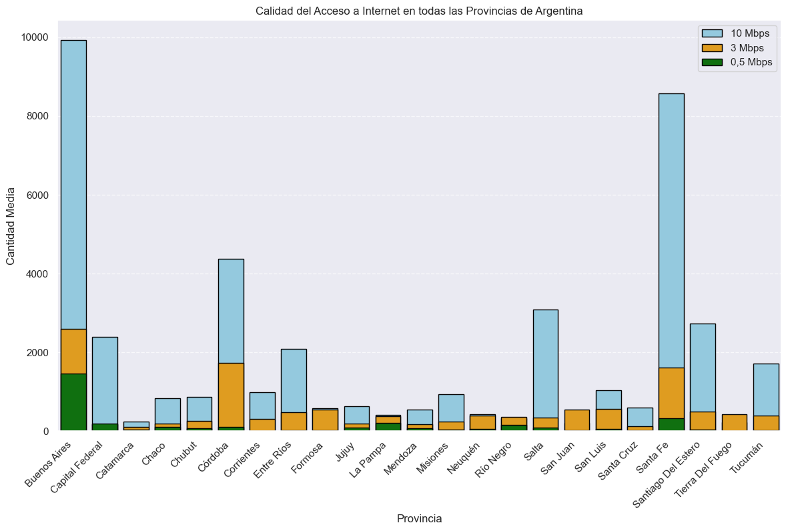
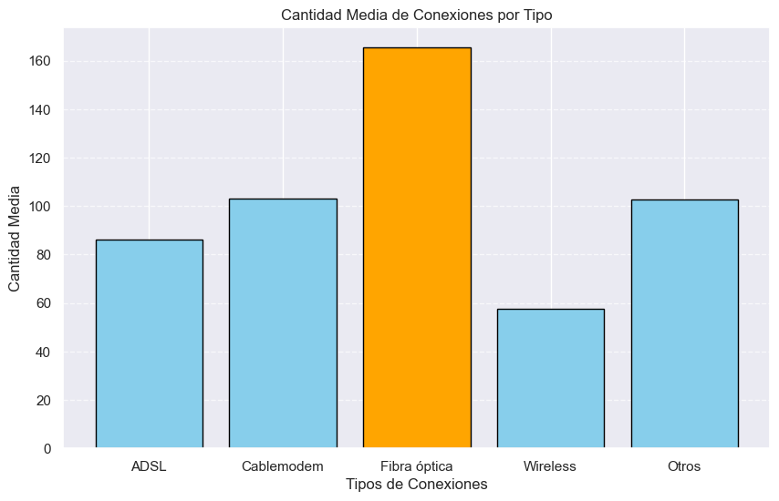

<h1>VecinoNet (Redes para Todos)</h1>

<h4>Este repositorio alberga el Proyecto Individual 2 de Data Analyst realizado durante el bootcamp de Henry.</h4>

## Introduccíon
En Argentina, garantizar el acceso a internet y considerarlo un derecho es una política pública en desarrollo. El Estado y diferentes actores, como empresas, pymes, cooperativas y organizaciones de la sociedad civil, trabajan en conjunto para garantizar la disponibilidad de la tecnología y desarrollar marcos legales y regulatorios necesarios.

Las Redes Comunitarias están jugando un papel importante en esta política y se están articulando estratégicamente para ser reconocidas en el ecosistema del internet.

## Descripción del Proyecto

El proyecto **VecinoNet: Redes para Todos**, surge como respuesta a la creciente importancia del acceso a Internet en el desarrollo y la educación de las comunidades, especialmente aquellas con recursos limitados. El análisis se fundamenta en datos recopilados por [ENACOM](https://datosabiertos.enacom.gob.ar/home) , centrándose en comunidades y provincias de bajos recursos en Argentina.

El objetivo principal de **VecinoNet** es explorar el surgimiento y el progreso del movimiento de redes comunitarias en el país. Estas redes, construidas por y para la comunidad, representan una oportunidad única para abordar la brecha digital y proporcionar acceso a la tecnología de manera inclusiva.

El análisis se adentra en las condiciones y necesidades específicas de estas comunidades, identificando barreras que podrían obstaculizar el acceso a políticas y recursos que sustenten la conectividad. Al entender estas limitaciones, **VecinoNet** busca proponer soluciones y estrategias que fomenten el acceso equitativo a Internet, impulsando así el **desarrollo socioeconómico** y la mejora de la **educación** en estas áreas.

Este proyecto no solo destaca la importancia del acceso a Internet, sino que también aborda las implicaciones más amplias de la conectividad, como la participación **cívica**, el acceso a **oportunidades laborales** y la mejora de la **calidad de vida**. **VecinoNet** aspira a ser un catalizador para el cambio positivo, trabajando hacia la creación de una **sociedad** más **conectada** e **inclusiva**.

## Fases del Proyecto

En el transcurso de este proyecto, hemos empleado datos accesibles a través de este [ENLACE](https://datosabiertos.enacom.gob.ar/dashboards/20000/acceso-a-internet/), que alberga los conjuntos de datos cruciales para nuestra investigación. Los conjuntos de datos que hemos utilizado incluyen registros **históricos de la velocidad de Internet de descarga** y media para diversas provincias, el **acceso a tecnologías**, los **ingresos** derivados de **servicios de Internet**, así como información sobre la **velocidad de Internet fijo de bajada**, segmentada por **provincia** y **localidad**.

Para garantizar la integridad de nuestros análisis, hemos llevado a cabo un proceso de Extracción, Transformación y Carga [ETL](https://github.com/Chinaskidev/VecinoNet_Proyecto/blob/master/tele_ENACOM_ETL.ipynb) . En esta fase, nos centramos en identificar posibles datos corruptos o incoherentes, preparándolos para la siguiente etapa de nuestro proyecto: el Análisis Exploratorio de Datos [EDA](https://github.com/Chinaskidev/VecinoNet_Proyecto/blob/master/tele_ENACOM_EDA.ipynb) . Durante la **EDA**, hemos efectuado una limpieza detallada y llevado a cabo análisis profundos sobre los datos recopilados en la fase de **ETL**.

Nuestro enfoque durante la **EDA** ha involucrado la implementación de análisis estadísticos que nos han proporcionado valiosas perspectivas sobre la naturaleza de los datos. Este análisis ha servido como base para la creación de gráficos informativos y visualizaciones, contribuyendo a una comprensión más profunda de los patrones y tendencias presentes en nuestros conjuntos de datos.

El flujo metodológico riguroso desde la extracción de datos hasta el análisis y la creación de visualizaciones ha fortalecido la calidad y fiabilidad de nuestras conclusiones, permitiéndonos obtener información significativa y respaldar nuestras interpretaciones.

## Analisis de los Datos

**Análisis de Velocidad de Descarga de Internet en Provincias Argentinas**

El análisis se centra en la evaluación de la velocidad de descarga promedio de Internet en distintas provincias de Argentina durante el período comprendido entre**2014** y **2022**, dividido por años y trimestres. La información recopilada ofrece una perspectiva detallada sobre la evolución temporal de la velocidad de descarga en el país.

- **Velocidad Promedio:** La velocidad de descarga promedio se sitúa en torno a 302.41 Megabits por segundo (Mbps).

- **Variabilidad:** La variabilidad de las velocidades, medida por la desviación estándar de 287.31 Mbps, indica un rango significativo en las velocidades de descarga registradas.

- **Amplitud del Rango:** Los datos reflejan velocidades que oscilan desde un mínimo de 1 Mbps hasta un máximo de 988 Mbps.

El análisis proporciona una visión integral de la velocidad de descarga de Internet en las provincias argentinas a lo largo del tiempo. Los resultados revelan tanto la tendencia general como la variabilidad en las velocidades. Estos hallazgos son esenciales para comprender la calidad del acceso a Internet y pueden ser fundamentales para futuras mejoras en la infraestructura de conectividad en el país.

**Análsis de la Calidad del Acceso a Internet en Distintas Provincias**

El gráfico de barras que se muestra debajo del texto proporciona una representación visual clara de la calidad del acceso a Internet en distintas provincias de Argentina. A través de la comparación de las velocidades de descarga de 0,5 Mbps, 3 Mbps y 10 Mbps, se destaca la variabilidad en el rendimiento de Internet en diferentes regiones. Las provincias con barras más altas en cada categoría indican una mejor calidad de acceso a Internet, mientras que la agrupación por provincia facilita la comparación y revela patrones geográficos en la distribución de velocidades. 

 

La disparidad en las velocidades entre provincias sugiere la necesidad de políticas que promuevan la equidad en el acceso a servicios de Internet. Garantizar una distribución uniforme de velocidades puede contribuir al desarrollo equitativo en todas las regiones.

La variación en las tendencias temporales resalta la importancia de realizar análisis más detallados para comprender las razones detrás de los cambios en las velocidades. Esto podría involucrar investigaciones sobre inversiones en infraestructura, cambios en la demanda de servicios, u otros factores relevantes como la inflación que se vive en el país.

**Análisis del Acceso a Tecnologias**

La presencia de **tecnologías** como la **fibra óptica** y el **cablemódem**, que generalmente ofrecen velocidades más altas, sugiere una tendencia hacia conexiones de Internet de mayor velocidad.

Entre los tipos de conexiones representados, la **fibra óptica** tiene la cantidad media más alta, evidenciando su relevancia y posiblemente indicando una preferencia creciente por esta tecnología.

Si bien no alcanzan la cantidad media de la **fibra óptica**, el **cablemódem** y la categoría **"Otros"** también muestran valores significativos, sugiriendo una diversidad en las opciones de conexión.

**ADSL** y **Wireless**, estas dos categorías presentan cantidades medias más bajas en comparación con la **fibra óptica**, **cablemódem** y **"Otros"**, indicando que podrían ser menos predominantes o menos utilizadas en este contexto.

En el gráfico que se muestra debajo del texto proporciona una visión clara de la cantidad media de conexiones para diferentes tipos, resaltando la relevancia de la fibra óptica y la diversidad en la elección de tecnologías en el contexto representado.

  

En el siguiente gráfico de barras apiladas presenta la distribución de las tecnologías de conexión a Internet en distintas provincias de Argentina. Cada barra representa una provincia y se subdivide en segmentos que representan las tecnologías específicas, siendo estas ADSL, Cablemódem, Wireless y Otros.

  

 La prominencia de la tecnología de Fibra Óptica, con su alta velocidad y confiabilidad, destaca la presencia de avances tecnológicos en algunas provincias. Sin embargo, este panorama también sugiere una posible brecha en el acceso tecnológico, ya que otras provincias podrían depender de tecnologías menos avanzadas. 

La diversidad en las preferencias tecnológicas, incluyendo opciones como "Cablemodem" y otras tecnologías, señala la adaptabilidad a diversas necesidades de los usuarios. Sin embargo, es crucial reconocer que algunas tecnologías más avanzadas podrían estar fuera del alcance de personas de bajos recursos, lo que subraya desafíos en la inclusión digital.